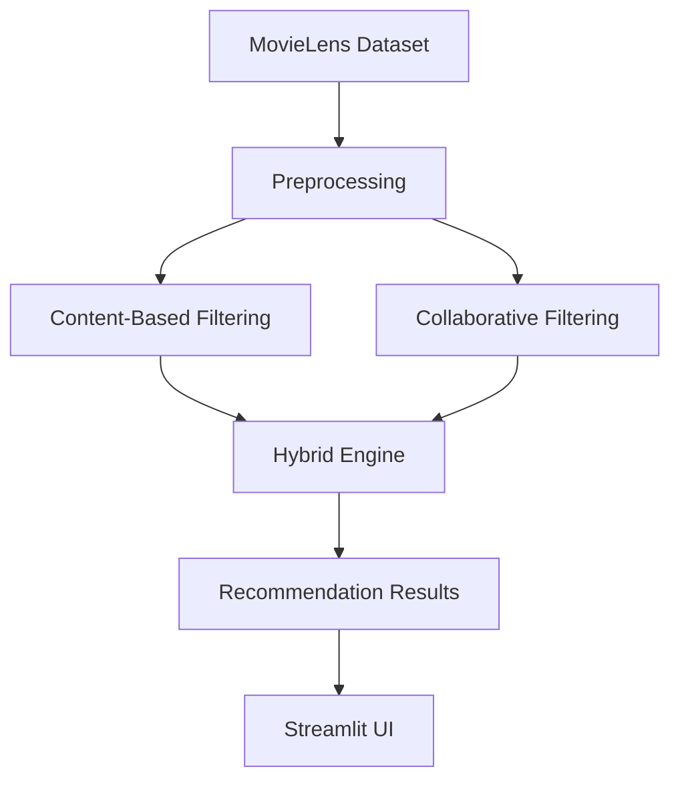

# 🎬 Hybrid Movie Recommendation System

## 📌 Objective
This project aims to build a **hybrid recommendation system** that intelligently merges **content-based filtering** and **collaborative filtering** to provide accurate and personalized movie recommendations based on user preferences and rating history.

---

## 📊 Features

✅ Personalized recommendations using hybrid techniques  
✅ Interactive **Streamlit UI** for user interaction  
✅ Real-time filtering based on genre, ratings, and preferences  
✅ Content-based filtering using **TF-IDF** and **cosine similarity**  
✅ Collaborative filtering using **SVD** from the Surprise library  
✅ Hybrid scoring using **weighted averaging**  
✅ Evaluation metrics: **RMSE**, **MAE**, **Precision**, **Recall**, **F1-Score**  
✅ Visualization of user similarity and recommendation results  
✅ Modular and extensible code structure  
✅ Ready for deployment on cloud platforms (e.g., Streamlit Cloud, Heroku)

---

## 🧠 System Architecture



---

## 📂 Dataset

- **Source:** [MovieLens 100K Dataset](https://www.kaggle.com/datasets/sriharshabsprasad/movielens-dataset-100k-ratings)
- Includes:
  - User ratings
  - Movie metadata (title, genre)
  - User demographic data

---

## ⚙️ Functional Components

### 🔹 1. Data Ingestion & Preprocessing
- Load user and movie datasets
- Handle missing/null values
- Normalize and clean data

### 🔹 2. Content-Based Filtering
- Apply **TF-IDF** vectorization on movie genres
- Compute **cosine similarity**
- Recommend based on item similarity

### 🔹 3. Collaborative Filtering
- Use **SVD** for matrix factorization (Surprise library)
- Train model on user-item rating matrix
- Predict unseen ratings

### 🔹 4. Hybrid Recommendation Engine
- Combine predictions from both models
- Use **weighted averaging** (weights tunable)
- Rank final recommendations

### 🔹 5. Streamlit UI
- Collect user preferences and ratings
- Show top-N recommendations
- Optional: Filter by genre or rating range

### 🔹 6. Evaluation
- Train/test split (e.g., 80/20)
- Metrics: **RMSE**, **MAE**, **Precision**, **Recall**, **F1-score**
- Compare models and visualize performance

---

## 🧰 Tech Stack

| Component            | Technology              |
|---------------------|--------------------------|
| Programming Language| Python                   |
| Recommendation Lib  | Surprise, Scikit-learn   |
| Vectorization       | TF-IDF (Scikit-learn)    |
| UI Framework        | Streamlit                |
| Evaluation          | NumPy, Pandas, Matplotlib|
| Deployment (Optional)| Streamlit Cloud, Heroku |

---

## 🚀 Getting Started

### 🖥️ Installation

```bash
# Clone the repository
git clone https://github.com/yourusername/hybrid-recommender.git
cd hybrid-recommender

# Create and activate a virtual environment (optional)
python -m venv venv
source venv/bin/activate  # or venv\Scripts\activate on Windows

# Install dependencies
pip install -r requirements.txt
```

### ▶️ Run the App

```bash
streamlit run app.py
```

---

## 📊 Evaluation Metrics

| Metric   | Description                              |
|----------|------------------------------------------|
| RMSE     | Root Mean Square Error of predicted ratings |
| MAE      | Mean Absolute Error of predictions       |
| Precision| Fraction of relevant recommendations     |
| Recall   | Fraction of relevant items recommended   |
| F1-Score | Harmonic mean of Precision and Recall    |

---

## 📈 Future Improvements

- ✅ Incorporate **deep learning models** (e.g., Autoencoders)
- ✅ Add **user registration and login**
- ✅ Implement **real-time feedback loops**
- ✅ Include **movie posters and trailers**
- ✅ Add **explainable AI (XAI)** features to explain recommendations
- ✅ Enable **cross-domain recommendations** (e.g., books, music)

---

## 📃 Deliverables

- `data_processing.py`: Preprocessing script
- `content_based.py`: Content-based model
- `collaborative_filtering.py`: SVD model
- `hybrid_model.py`: Hybrid logic
- `app.py`: Streamlit application
- `evaluation_report.md`: Model performance and analysis

---

## 🔗 References

- 📚 [MovieLens GroupLens](https://en.wikipedia.org/wiki/GroupLens_Research)  
- 📘 [Hybrid Recommender Survey (JAIT)](https://www.jait.us/uploadfile/2021/0719/20210719052408995.pdf)

---

## 📝 License

This project is licensed under the **MIT License**.  
Feel free to fork, modify, and use it for educational or commercial purposes.
